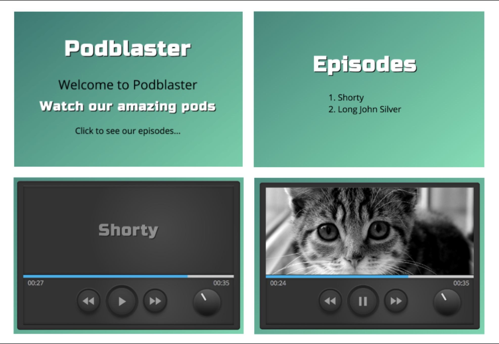

# Assignment #

The task is to build a simple podcast player.
Please create a new repo that contains your player, and use this server but don't modify it.

## Assessment

When assessing the assigment, we will look at the code to see how well it is structured, how easy it is to read and how simple it would be to maintain.

We expect that you'll be able to motivate and discuss the benefits and drawbacks of the choices in your solution.

We understand that there isn't a lot of time for implementation, and we keep that in mind. We expect that the code will have both strong and weak areas, and we'll be looking to bring those up when we meet to discuss your solution.

Basically, we want to see your version of "clean code", and then have a discussion around it.

Also, please list what you left out. For example things that you would have spent more time on if you had more time, and what things you did not spend time on at all.

## Provided Materials ##

Contained within this package is a simple server with the following endpoints:

`/episodes` returns episodes list.

`/episodes/:episode_id` returns info about one episode.

Install the dependencies by running `npm install`.
Run the server with `npm start`.
Then the server listens at port 1337, so for example the list of all episodes is at `http://localhost:1337/episodes`.

Static assets are in `/audio` and `/images`.

### Basic playback ###

The player allows the user to play, pause, seek forward/back (jump ahead or back five seconds), and to jump to a user-chosen point in the timeline.

*Implemented. The user clicks on selected places on the timeline and jumps to a specific location in the pod. The user is able to play, pause and jump five seconds forward or backword with the buttons.*

### Markers ###

The player also features "markers". A marker is a text, an image or an advertisement that is shown to the user when the current playback time is within the markers start and end time. At most one marker is displayed at any point in time.

*Implemented. Markers are displayed on defined sequences, according to the given serverside data. Insted of having a blank screen in sequences where markers are not present, or when the audio player is not playing, I have chosen to show the name of the pod.*

#### Text Link Marker ####

Displays text.

*Implemented. Text is displayed on selected sequences during playback.*

#### Image Link Marker ####

Displays an image.

*Implemented. Images are displayed on selected sequences during playback.*

#### Advertisement (Ad) Marker ####

Displays text that links to an external URL.

*Implemented. Ads appear on selected sequences during playback. Clicking on the ad brings you to the given url.*

##### Optional #####

If you feel the have the time and desire, after making a solid foundation with the aforementioned features, you can make the ad markers a little bit special. If an ad is playing the user shall not be able to skip past it. Playing and pausing is OK. If the user attempts to skip past an entire ad marker then the skipped over ad marker shall play before continuing to the position the user skipped to.

*Implemented. If the user clicks on fast forward when an ad is displayed, then the ad will finish playing before jumping to the chosen position. The user does not get an indication that the ad must be completed before it jumps forward to the selected place. In a realtime scenario, this would have been desirable, to avoid confusion.*

##### Additional notes #####

*The application is responsive, targeting desktop and mobile devices. Techniques used are plain javaScript and CSS. The code is structured by separation of concerns with the modules player, volume, progress and markers, according to "revealing module pattern". Each module has private and public functions and are also able to inherit the prototype from any other of the modules. Helper functions are also added for the modules to use. CSS is divided following the same pattern as the javascript files. With more time I would have prefered to use Sass with nested selectors. I would also have implemented unit tests with Jest.*

*Build process with minification of code is not implemented due to shortage of time. I could have implemented the application with a framework such as React/Redux, but my first priority was to demonstrate my javascript skills.*

*I have also added a volume feature, which was not required. The volume knob is functional and the user rotates it to adjust the sound level.*  
&nbsp;
